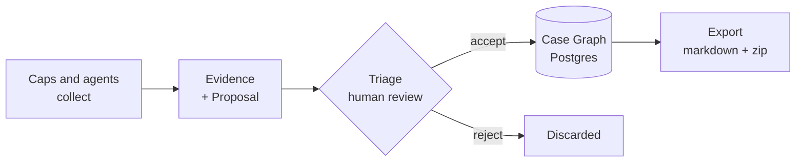

<div align="center">
    <p>
        <a href="https://github.com/kzndotsh/watchdog/actions/workflows/ci.yml">
            </a>
        <a href="https://www.typescriptlang.org">
            </a>
        <a href="https://effect.website">
            </a>
        <a href="https://tanstack.com/start">
            </a>
        <a href="https://www.postgresql.org">
            </a>
        <a href="https://orpc.dev">
            </a>
    </p>
    <h1>Watchdog</h1>
    <p><strong>An OSINT case platform where machines collect and humans decide.</strong></p>
    <p>
        <a href="#quick-start">Quick start</a> •
        <a href="#capabilities">Caps</a> •
        <a href="#architecture">Architecture</a> •
        <a href="#status">Status</a> •
        <a href="docs/README.md">Docs</a> •
        <a href="ROADMAP.md">Roadmap</a>
    </p>
</div>

> [!WARNING]
>
> **Pre-1.0 and under active development.** Schemas, Cap ids, and API shapes change without notice, and several surfaces in [`ROADMAP.md`](ROADMAP.md) are half-built. Organization-scoped tenancy (Better Auth orgs, invites, org-bound cases) ships for small teams, but the install is not hardened for hostile multi-tenant SaaS or production deployment at scale.

## Why

Small-team OSINT usually runs on general-purpose tools: a chat thread for coordination, a growing document for the case file, an assistant for summarizing, and ad-hoc scripts for collection. That works until the case gets big enough to hit the same failures every time.

- Summaries get treated as fact, with no evidence chain behind them.
- The system of record becomes the chat log, and separate copies of the case file diverge.
- Catching up means reading scrollback instead of reading the case.
- Identity links rest on a matching handle, a shared mailbox, or a coincidence.
- More collection produces less clarity rather than more.

Watchdog exists for the opposite: one case graph of claims and evidence you can defend, built while collection stays fast. Every claim carries its evidence, a person accepts each one before it lands, and the whole case exports as a package you can hand to someone else.

## How it differs

The nearest tools are MISP, TheHive with Cortex, IntelOwl, SpiderFoot, and FlowSint. All are mature and solve real problems. The difference is where machine output is allowed to land.

In most of them the collector writes the graph. SpiderFoot persists every event it finds as fact, TheHive imports analyzer artifacts into the case when a job finishes, FlowSint enrichers write to Neo4j at the end of each step, and IntelOwl merges analyzer votes into a single evaluation. That's a fair trade for threat intel, where corpus volume matters more than the provenance of any one row. It's the wrong trade for a case you may have to defend, so a Cap here produces evidence and a proposal, and nothing reaches the graph until a person accepts it.

Confidence works differently too. These tools express it as numeric scores, decay models, or severity labels. Claims here land as `unverified` and a human moves them to `possible` or `confirmed` at Accept, where `confirmed` requires cited evidence. There's also no automatic fan-out and no crawler. Jobs start explicitly and reason over one case, because a seed that expands into hundreds of module runs is how you end up with more data and less clarity.

The boundary is enforced by types rather than convention: a Cap's runtime context has no database handle, and the patch schema rejects any operation carrying a `confidence` value. Postgres holds the truth, and the markdown export is a projection you can delete and regenerate.



## Quick start

Requires Docker, Node ≥ 22, pnpm 11. [Nix](https://nixos.org/download) is optional and pins the whole toolchain.

```bash
git clone https://github.com/kzndotsh/watchdog.git
cd watchdog
nix develop                 # optional
cp env.example .env         # set BETTER_AUTH_SECRET + WD_MASTER_VAULT_KEY
                            # openssl rand -base64 32
pnpm install
just dev                    # Postgres + MinIO + migrations + web + worker
```

No account is seeded and registration is closed by default. See [`docs/how-to/onboarding.md`](docs/how-to/onboarding.md) and [`docs/how-to/auth-setup.md`](docs/how-to/auth-setup.md) for signup, invites, and env detail.

**Bootstrap:** set `BETTER_AUTH_ALLOW_SIGNUP=1`, create the first account at `/auth/sign-up`, then set the flag back to `0`. That user becomes instance admin and owner of the install organization (`Watchdog`). Everyone else joins via Settings → **Team** invite (copy link, or optional SMTP in `.env`).

**First investigation tutorial:** [`docs/tutorials/first-investigation.md`](docs/tutorials/first-investigation.md) (dump → Process → Triage → Dossier).

Everything binds to loopback: web on `:3000`, Postgres on `:5432`, MinIO on `:9100` with its console on `:9101`. Agents: [`docs/how-to/agent-cli.md`](docs/how-to/agent-cli.md) · OpenAPI `/api/v1/spec.json`.

**pnpm only.** Version is pinned in `package.json`; npm and yarn will produce a broken workspace.

## Environment

`@watchdog/env` validates these at boot, so a bad `.env` fails immediately rather than at first query. Copying `env.example` gives you working local defaults for everything except the two secrets.

**Required**

| Variable | Description |
| --- | --- |
| `DATABASE_URL` | Postgres connection string |
| `BETTER_AUTH_SECRET` | Session signing key, 32+ chars |
| `WD_MASTER_VAULT_KEY` | Encrypts Cap credentials at rest; 32-byte base64 or 64-char hex |
| `S3_ENDPOINT` · `S3_ACCESS_KEY` · `S3_SECRET_KEY` · `S3_BUCKET` | Evidence and artifact storage |

**Optional**

| Variable | Description |
| --- | --- |
| `DATABASE_URL_MIGRATE` | Superuser URL for migrations; falls back to `DATABASE_URL` |
| `BETTER_AUTH_URL` | Default `http://127.0.0.1:3000` |
| `BETTER_AUTH_ALLOW_SIGNUP` | Open registration; default off (solo bootstrap only) |
| `BETTER_AUTH_TRUSTED_ORIGINS` | Comma-separated extra origins |
| `SMTP_HOST` · `SMTP_FROM` | Optional invitation mail (`SMTP_PORT` / `SMTP_USER` / `SMTP_PASS`); copy-link works without SMTP |
| `S3_REGION` | Default `us-east-1` |
| `WD_EXPORT_DIR` | Markdown shadow location; default `<repo>/export` |
| `NODE_ENV` | `development` · `production` · `test` |

The CLI reads its own pair: `WD_API_URL` and `WD_API_KEY`, the latter created in Settings → API Keys. **Cap API keys never go here.** They live in the encrypted vault. API and CLI calls are scoped to the caller's Better Auth organization (session `activeOrganizationId`, or the key owner's membership).

## A case, end to end

```bash
wd cases create --name "Example"
# {"id":"0b8f…","name":"Example","slug":"example"}
wd jobs start -c 0b8f… --cap network.dns.lookup -i '{"host":"example.com"}'
# {"id":"3c21…","status":"queued","capabilityId":"network.dns.lookup"}
wd proposals list -c 0b8f…
# 1 proposal: 4 identifiers, 1 claim (job 3c21…)
wd proposals accept -c 0b8f… 4d90… --confidence possible
wd export zip -c 0b8f…
```

Output is compact JSON so it pipes into `jq`; add `--table` when a human is reading. Lists return a `help` array suggesting the next command, which is how agents navigate without a tutorial. Chain Caps with a playbook instead of running them one at a time:

```bash
wd jobs playbook -c 0b8f… --id host-footprint --host example.com
```

Agents propose by default. `wd graph write` skips Triage, but it needs an explicit `--user-override`, still lands at `unverified`, and records a row in `graph_writes`.

## Capabilities

Each Cap is a folder under `packages/caps/src/` named for its id, such as `network/dns.lookup/`, holding a `run` that collects and a pure `interpret` that maps the report to proposed operations. Keeping `interpret` pure means it tests against recorded fixtures with no network.

| Category | Count | Examples |
| --- | --- | --- |
| `network` | 25 | DNS, WHOIS/RDAP, certificate transparency, TLS audit, Shodan, urlscan |
| `threat` | 17 | VirusTotal, AbuseIPDB, GreyNoise, URLhaus, OTX, Safe Browsing |
| `identity` | 6 | GitHub, Keybase, Gravatar, PGP, email reputation |
| `breach` | 4 | HIBP, Dehashed, Snusbase, Hudson Rock |
| `archive` | 4 | Wayback lookup and fetch, Common Crawl, save-page |
| `evidence` | 4 | Deterministic harvest, AI extraction, file and `.eml` analysis |
| `web` | 3 | URL unshortening, page enrichment |

Every Cap declares its egress (29 make no third-party call at all) and tags itself `Passive` or `Active`, so you know before running one whether it touches the target. Credentials come from an encrypted vault at runtime via `ctx.getCredential`, never from environment variables or job input. Run `pnpm generate:caps` after adding one.

## Architecture

```
apps/
├── web/                  TanStack Start UI + oRPC handlers (RPC + OpenAPI)
└── worker/               pg-boss consumer that executes Cap jobs
packages/
├── env/                  T3 Env boot secrets, depends on nothing
├── schemas/              Zod contracts, PatchOp, vocabulary
├── policy/               Accept gates and custody rules, pure and DB-free
├── db/                   Drizzle schema + repos (the only SQL)
├── core/                 Effect domain layer: jobs, graph, evidence, export sync
├── caps/                 Cap implementations + playbooks
├── cap-sdk/              Cap SPI: defineCapability, CapContext
├── tools/                Dumb fetch/parse helpers, no Graph types
├── api/                  oRPC router, Zod procedures
├── client/               Typed SDK for /api/v1, generated from OpenAPI
├── cli/                  The `wd` binary, every noun the API exposes
├── ai/                   LLM providers + structuredExtract, never writes Graph
├── log/                  evlog process logging, NDJSON + stdout
└── test-kit/             Dev-only fixtures, Postgres harness, MSW
```

Dependencies flow one direction and the boundaries are enforced, not suggested: `caps` cannot import `db`, `api` cannot reach past `core` to SQL, and only `core` touches repos. Full matrix in [`docs/reference/platform/README.md`](docs/reference/platform/README.md).

### Effect

Most server-side product logic runs on **[Effect](https://effect.website)** (v4): `@watchdog/core` exposes `*Effect` entrypoints for cases, jobs, evidence, proposals, and export; the worker boots with `NodeRuntime.runMain`; Cap `run` handlers are Effect programs with tagged errors and `HttpClient` layers; pg-boss enqueue/cancel and job fibers use `FiberMap`, schedules, and scoped resources. The web app stays mostly React — ServerFns call into core via `runApp`, and the browser never imports Effect-tagged modules (policy exposes a thin `patch-needs-confidence` entry for Triage UI). Conventions and allowlisted `run*` edges: [`AGENTS.md`](AGENTS.md) · [`docs/reference/platform/jobs-orpc.md`](docs/reference/platform/jobs-orpc.md) · `node_modules/effect/AGENTS.md`.

### Organizations and tenancy

Better Auth **organizations** bound the case graph: each Case row carries an `organization_id`; list/get/create/update/delete and search filter on the active org. The first bootstrap user owns the single install org; later users join by invitation (`/auth/accept-invitation/{id}`) with org role `admin` or `member`. Instance admins (`auth.user.role`) manage accounts under Settings → **Users**; org admins invite under **Team**. Missing org context on an API call is **403**, not a silent cross-org leak. Details: [`docs/how-to/auth-setup.md`](docs/how-to/auth-setup.md) · [`docs/explanation/scenarios.md`](docs/explanation/scenarios.md).

A job's path: `enqueueCapJobEffect` → the `watchdog.cap-jobs` queue → worker runs the Cap → artifacts to S3, Proposal to Triage → Accept applies the patch in one transaction → worker re-syncs the case's markdown shadow.

| Layer | Stack |
| --- | --- |
| **Frontend** | TanStack Start · React · Tailwind 4 · shadcn/ui · TanStack Query |
| **API** | oRPC (RPC for the app, OpenAPI for agents) · Zod |
| **Data** | Postgres 18 · Drizzle ORM · MinIO/S3 |
| **Jobs** | pg-boss · dedicated worker process · Effect fibers + tagged errors |
| **Auth** | Better Auth (sessions, orgs, invites, API keys, instance admin) |
| **Observability** | evlog structured wide events |
| **Tooling** | pnpm · Nix · just · Vitest · Playwright · oxlint · oxfmt |

## Commands

| Task | Command |
| --- | --- |
| Dev servers | `just dev` · `pnpm dev:web` · `pnpm dev:worker` |
| Database | `pnpm db:migrate` · `pnpm db:generate` · `pnpm db:studio` |
| Local infra | `just up` · `just down` · `just docker-up` (containers only) |
| Reset case data, keep auth (orgs + vault) | `just wipe` |
| Lint and format | `pnpm check` · `pnpm fix` |
| Types | `pnpm typecheck` |
| Tests | `pnpm test` · `pnpm test:component` · `pnpm test:integration` · `pnpm test:e2e` · `pnpm test:e2e:smoke` |
| Codegen | `pnpm generate:caps` · `pnpm generate:client` |
| Desloppify (optional) | `pnpm desloppify:scan` · `pnpm desloppify:status` · `pnpm desloppify:next` (`.desloppify/` gitignored) |

Integration and end-to-end runs need their own databases first: `just test-db`.

## Status

Third design, first one that ships. A vault-plus-Python-pipeline version and a broad platform spec both got frozen before this; [`docs/explanation/product.md`](docs/explanation/product.md) records what each one taught and what not to resurrect.

Today: **63 Caps**, **14 packages**, **~980 unit/property tests** plus component, integration, and Playwright tiers green. The investigator loop runs end to end: bootstrap auth, org-scoped cases, dump evidence, run Caps, accept proposals, export the package.

Not there yet, worth knowing before you invest time:

- **MCP server.** Not built. Agents use the OpenAPI surface today.
- **Playbooks** are linear chains, with no branching and no conditionals.
- **Multi-org SaaS.** Single install org at bootstrap; no self-serve org creation or billing. Team invite + org-scoped cases work for a small shop, not arbitrary tenant isolation under attack.
- **End-to-end coverage** — 18 Playwright specs in `e2e/specs/` (`@smoke` / `@custody` / `@journey`), including auth sign-up, team invite, and instance-admin Users, on top of unit, component, and integration tiers — not full manual-smoke parity yet.

Investigation content (corpus, entity notes, mirrors) lives in a separate private repo and never enters this one.

## Docs

| Read | For |
| --- | --- |
| [`docs/explanation/product.md`](docs/explanation/product.md) | Intent, personas, what this refuses to build and why |
| [`docs/reference/platform/README.md`](docs/reference/platform/README.md) | Packages, import rules, jobs, oRPC, logging |
| [`docs/reference/platform/jobs-orpc.md`](docs/reference/platform/jobs-orpc.md) | Jobs queue, oRPC/OpenAPI, Effect runtime edges |
| [`docs/how-to/auth-setup.md`](docs/how-to/auth-setup.md) | Bootstrap, orgs, invites, API keys, actor labels |
| [`docs/reference/platform/caps-lexicon.md`](docs/reference/platform/caps-lexicon.md) · [`packages/caps/AGENTS.md`](packages/caps/AGENTS.md) | Cap naming, method vocabulary, ship gates, how to write one |
| [`docs/reference/platform/types.md`](docs/reference/platform/types.md) | Shared Zod schemas and vocabulary |
| [`docs/explanation/ux.md`](docs/explanation/ux.md) | Information architecture and investigator flows |
| [`docs/reference/web/`](docs/reference/web/README.md) | UI, design system, domains, data fetching |
| [`AGENTS.md`](AGENTS.md) | Conventions for coding agents in this repo |

## License

TBD

Created by [@kzndotsh](https://github.com/kzndotsh)
