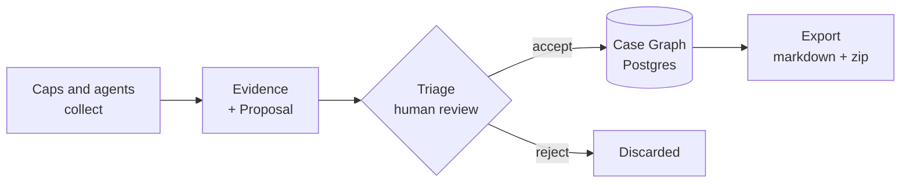

      

# Watchdog

## Investigations are messy. Your OSINT work requires a place you can trust.

[Quick start](#quick-start) • [Caps](#capabilities) • [Architecture](#architecture) • [Docs](#docs) • [Roadmap](ROADMAP.md)

> [!WARNING]
>
> **Pre-1.0 and under active development.** Schemas, Cap ids, and API shapes change without notice, and several surfaces in [ROADMAP.md](ROADMAP.md) are half-built. Organization-scoped tenancy (Better Auth orgs, invites, org-bound cases) ships for small teams, but the install is not hardened for hostile multi-tenant SaaS or production deployment at scale.

## Why Watchdog

Most tools are built to collect. Watchdog is built to conclude.

### What usually goes wrong:

Small-team OSINT usually runs on general-purpose tools: a chat thread for coordination, a growing document for the case file, an assistant for summarizing, and ad-hoc scripts for collection. That works until the case gets big enough to hit the same failures every time.

- Summaries and assumptions get treated as fact.
- The case lives in three places at once. None of them agree.
- More lookups produce more data, not more clarity.
- A coincidence becomes a confirmed link.

### Watchdog was built to solve these problems.

- You decide what lands: every result comes back as a proposal, not a conclusion. Nothing reaches the case until you say so.
- One source of truth: the "real" case lives in one place — not a thread, not a doc. One graph, one record. The export regenerates from it any time.
- Collect without the noise: run as many lookups as you need. Accept what holds, reject what doesn't. The case grows with your judgment.

## How it differs

The nearest tools are MISP, TheHive with Cortex, IntelOwl, SpiderFoot, and FlowSint. All are mature and solve real problems. The difference is where machine output is allowed to land.

In most of them the collector writes the graph. SpiderFoot persists every event it finds as fact, TheHive imports analyzer artifacts into the case when a job finishes, FlowSint enrichers write to Neo4j at the end of each step, and IntelOwl merges analyzer votes into a single evaluation. That's a fair trade for threat intel, where corpus volume matters more than the provenance of any one row. It's the wrong trade for a case you may have to defend, so a Cap here produces evidence and a proposal, and nothing reaches the graph until a person accepts it.

Confidence works differently too. These tools express it as numeric scores, decay models, or severity labels. Claims here land as `unverified` and a human moves them to `possible` or `confirmed` at Accept, where `confirmed` requires cited evidence. There's also no automatic fan-out and no crawler. Jobs start explicitly and reason over one case, because a seed that expands into hundreds of module runs is how you end up with more data and less clarity.

The boundary is enforced by types rather than convention: a Cap's runtime context has no database handle, and the patch schema rejects `confidence` on claim, identifier and edge operations (it is chosen at Accept). Postgres holds the truth, and the markdown export is a projection you can delete and regenerate.


```mermaid
flowchart LR
  A["Caps and agents<br/>collect"] --> B["Evidence<br/>+ Proposal"]
  B --> C{"Triage<br/>human review"}
  C -->|accept| D[("Case Graph<br/>Postgres")]
  C -->|reject| X["Discarded"]
  D --> E["Export<br/>markdown + zip"]
```

## Quick start

Requires Docker, Node ≥ 22, pnpm 11. [Nix](https://nixos.org/download) is optional and pins the whole toolchain.

```bash
git clone https://github.com/kzndotsh/watchdog.git
cd watchdog
cp env.example .env         # set BETTER_AUTH_SECRET + WD_MASTER_VAULT_KEY
pnpm install
just dev                    # Postgres + S3 + migrations + web app + worker + marketing site
```

## Capabilities

Each Cap is a folder under `packages/caps/src/` named for its id, such as `network/dns.lookup/`, holding a `run` that collects and a pure `interpret` that maps the report to proposed operations. Keeping `interpret` pure means it tests against recorded fixtures with no network.

| Category | Examples |
| --- | --- |
| `network` | DNS, WHOIS/RDAP, certificate transparency, TLS audit, Shodan, urlscan |
| `threat` | VirusTotal, AbuseIPDB, GreyNoise, URLhaus, OTX, Safe Browsing |
| `identity` | GitHub, Keybase, Gravatar, PGP, email reputation |
| `breach` | HIBP, Dehashed, Snusbase, Hudson Rock |
| `archive` | Wayback lookup and fetch, Common Crawl, save-page |
| `evidence` | Deterministic harvest, AI extraction, file and `.eml` analysis |
| `web` | URL unshortening, page enrichment |

## Architecture

```
apps/
├── web/                  TanStack Start UI + oRPC handlers (RPC + OpenAPI)
├── site/                 Static marketing landing (Astro 7 + Tailwind 4) → `watchdog.com`
├── worker/               pg-boss consumer that executes Cap jobs
└── cli/                  The `wd` binary (compiled to dist/), every noun the API exposes
packages/
├── env/                  T3 Env boot secrets, depends on nothing
├── schemas/              Zod contracts, PatchOp, vocabulary
├── policy/               Accept gates and custody rules, pure and DB-free
├── db/                   Drizzle schema + repos (the only SQL)
├── core/                 Effect domain layer: jobs, graph, evidence, export sync
├── caps/                 Cap implementations + playbooks; Cap SPI in `caps/sdk`
├── tools/                Dumb fetch/parse helpers, no Graph types
├── api/                  oRPC router, Zod procedures
├── client/               Typed SDK for /api/v1 + the generated OpenAPI contract
├── ai/                   LLM providers + structuredExtract, never writes Graph
├── log/                  evlog process logging, NDJSON + stdout
├── auth/                 Better Auth server core: createAuth, createApiContext, invite signup, instance admin
├── ui/                   Generated shadcn (base-mira) primitives, locked via vendor.json
├── test-db/              Dev-only Postgres harness + seeds
└── test-kit/             Dev-only ids, URLs, fast-check, MSW; no workspace deps
```

## Docs

The [docs index](docs/README.md) lists everything. The ones you will want first:

| Doc | Read it for |
| --- | --- |
| [First investigation](docs/tutorials/first-investigation.md) | A guided case: dump evidence, process it, triage, build the dossier |
| [Auth setup](docs/how-to/auth-setup.md) | The first account, organizations, invites, API keys |
| [Local development](docs/how-to/local-dev.md) | The services, the ports, and the usual traps |
| [Agent CLI](docs/how-to/agent-cli.md) | Driving Watchdog with `wd` or an agent, and the OpenAPI spec at `/api/v1/spec.json` |
| [Product](docs/explanation/product.md) | What this is for, and what it refuses to build |
| [Platform reference](docs/reference/platform/README.md) | Packages and import rules, jobs, oRPC, Caps, schemas |
| [Web reference](docs/reference/web/README.md) | The UI, design system, domains, and data fetching |
| [Glossary](GLOSSARY.md) | What a Case, Evidence, Proposal and Accept mean here |
| [AGENTS.md](AGENTS.md) | Commands and conventions, including the rules coding agents break most |
| [Security](SECURITY.md) | Supported versions and reporting a vulnerability |

## License

TBD

Created by [@kzndotsh](https://github.com/kzndotsh)
